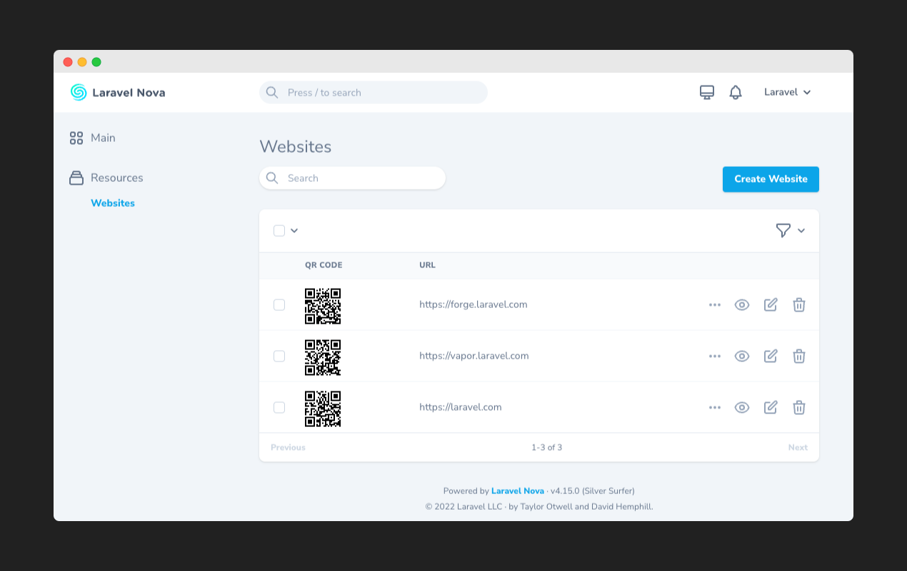

# Nova QR Code

A Laravel Nova field to generate QR Code.



## Installation

You can install the Nova field in to a [Laravel](http://laravel.com) app that uses [Nova](http://nova.laravel.com) via composer :

```cli
composer require devtical/nova-qrcode-field
```

## Usage

```
use Devtical\Qrcode\Qrcode;
```

#### Basic

```php
Qrcode::make('QR Code', 'field')
```

#### Setting sizes

```php
Qrcode::make('QR Code', 'field')
    ->indexSize(100)
    ->detailSize(500)
```


#### With logo

```php
Qrcode::make('QR Code', 'field')
    ->logo('http://source.to/logo.png')
```


#### With background

```php
Qrcode::make('QR Code', 'field')
    ->background('http://source.to/background.png')
```


#### With logo & background

```php
Qrcode::make('QR Code', 'field')
    ->logo('http://source.to/logo.png')
    ->background('http://source.to/background.png')
```


## Related

- [Nova QR Code Manager](https://github.com/Devtical/nova-qrcode-manager)

## Credits

- [vue-qr](https://github.com/Binaryify/vue-qr)
- [Awesome-qr.js](https://github.com/SumiMakito/Awesome-qr.js)

## License

The MIT License (MIT).
